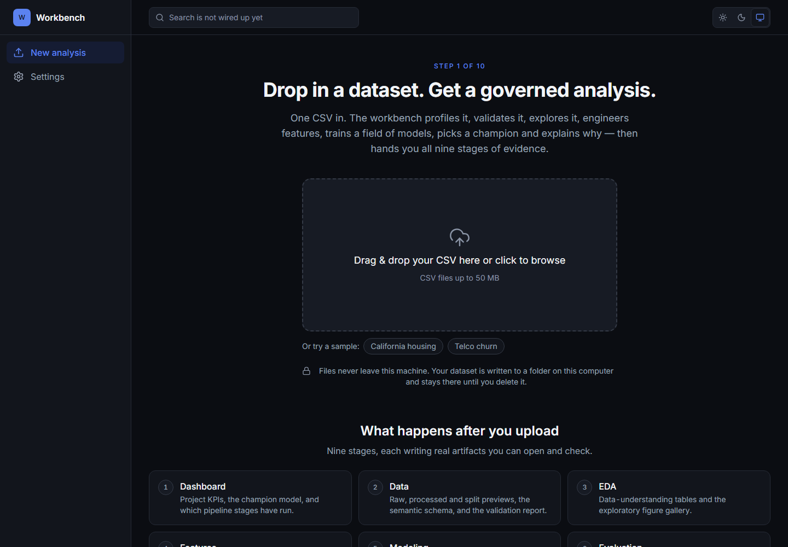
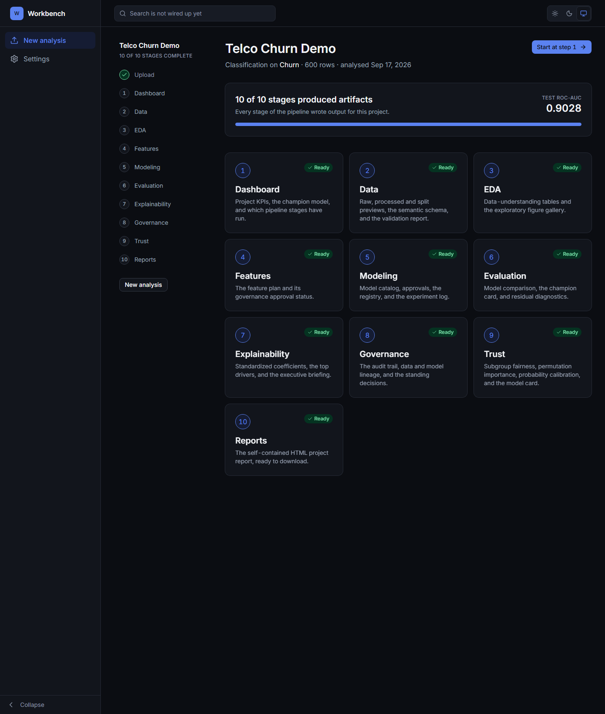
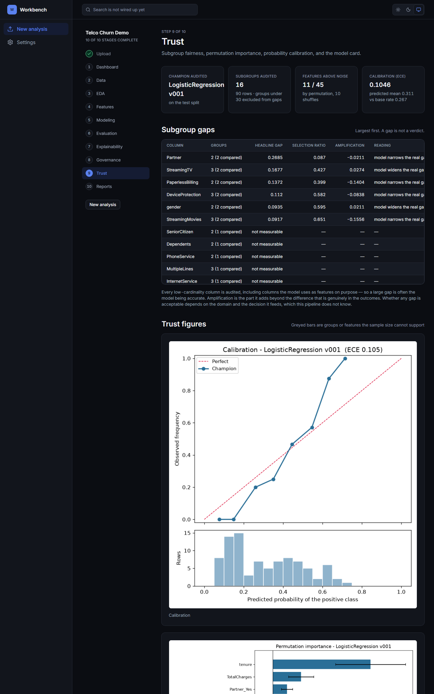
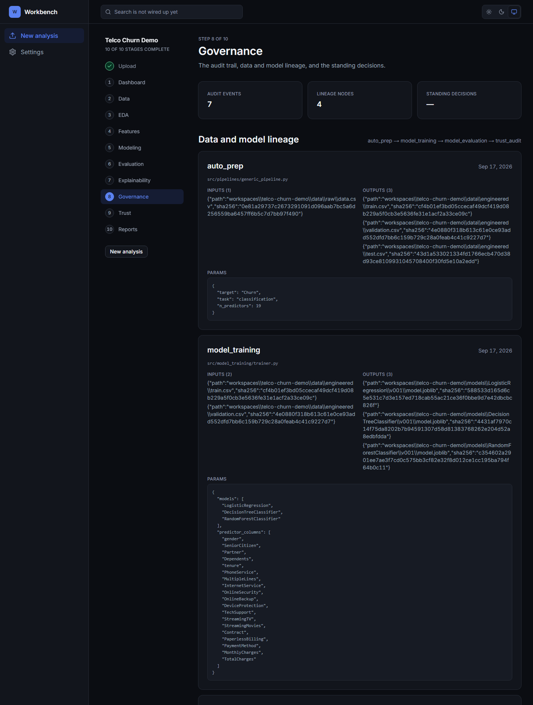
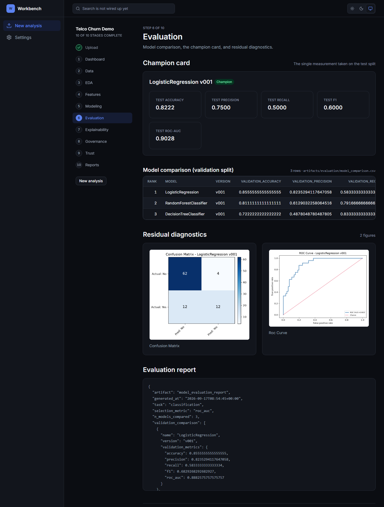
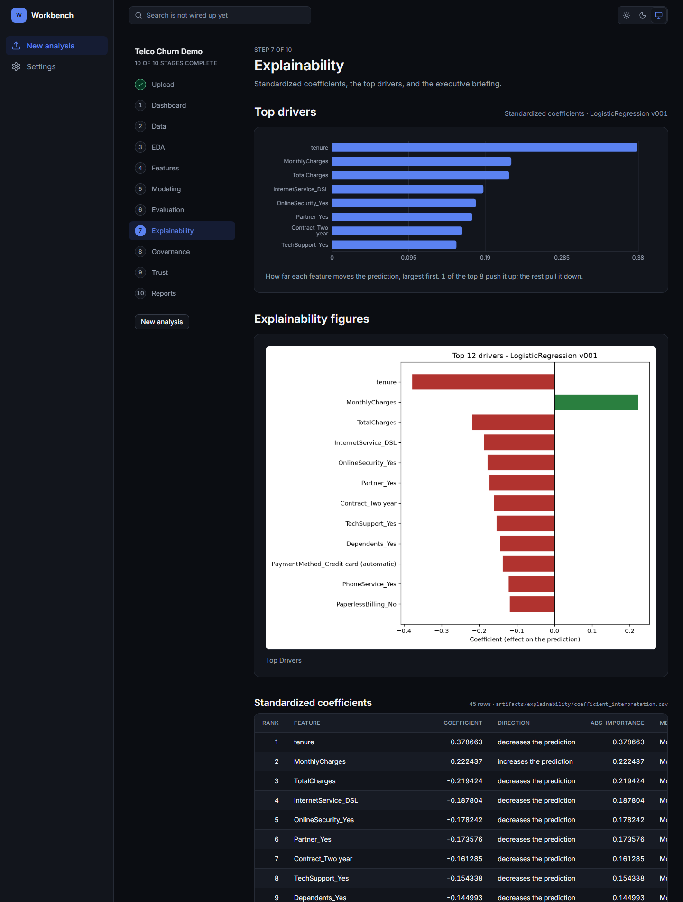
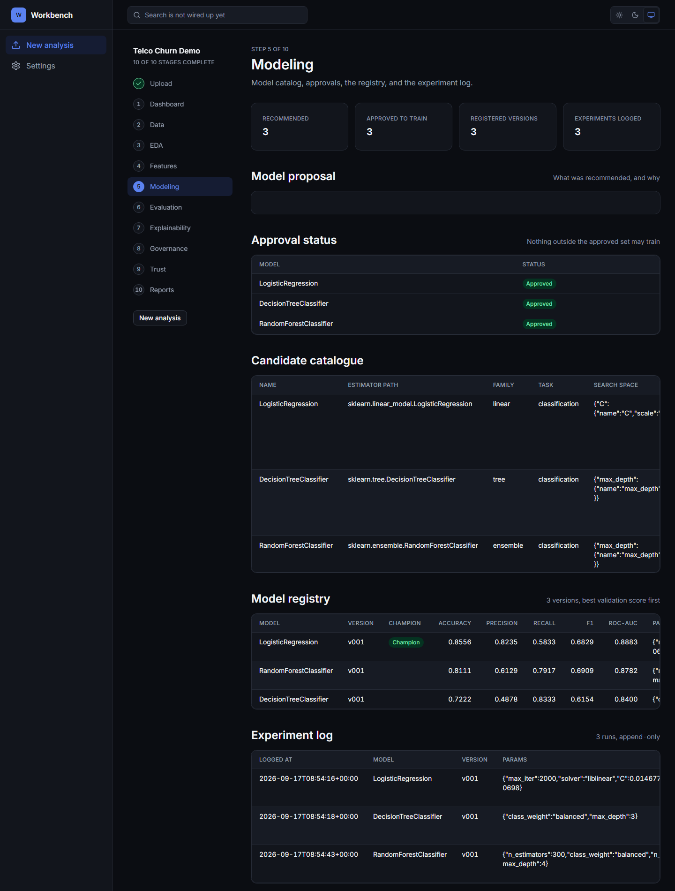
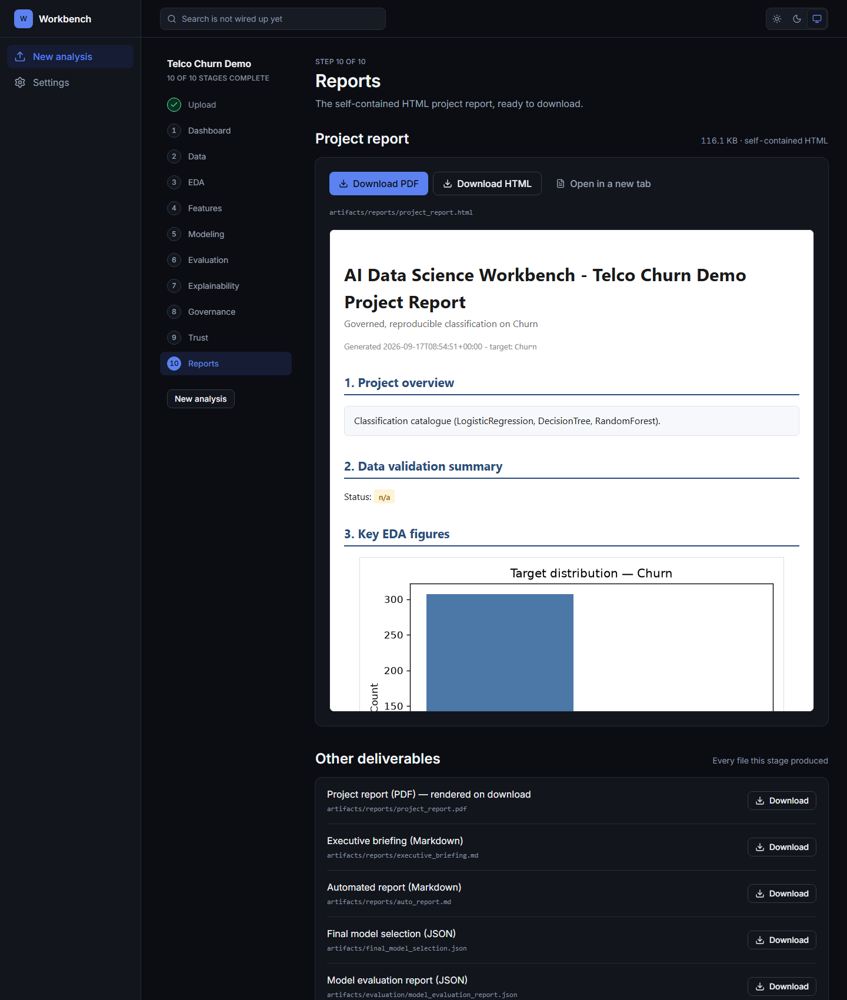

# AI Data Science Workbench — Console

A local-first review console for a **governed machine learning pipeline**. You drop
in a CSV; it profiles, validates, explores, engineers features, trains a field of
models, promotes a champion, audits that champion for bias and calibration, and
hands back ten stages of evidence you can open and check.

The claim is deliberately not *"the model is accurate"*. It is:

> The result is reproducible, the model choice is documented, leakage is
> structurally prevented, and the model's own bias is measured and published
> beside its accuracy.

**Source:** [Bala-Shunmugam-M/ai-data-science-workbench](https://github.com/Bala-Shunmugam-M/ai-data-science-workbench)
· **Live report site:** [bala-shunmugam-m.github.io/ai-data-science-workbench](https://bala-shunmugam-m.github.io/ai-data-science-workbench/)

---

## One CSV in, ten stages of evidence out



No account, no upload to anyone's server. The file is written to a folder on
your machine and stays there until you delete it — the analysis runs through the
same Python pipeline the CLI uses.

The two sample chips run 600-row extracts of California housing (regression) and
Telco churn (classification), so you can see the whole thing work before
committing your own data.

---

## The journey



Ten stages, each writing artifacts that actually exist on disk. A stage is only
marked complete when a **file** exists beneath its probe path — not merely a
directory, because stages create their output directories before doing any work.
An earlier version checked for the directory and cheerfully reported "10 of 10
stages produced artifacts" after a crashed EDA run.

---

## The Trust stage — the part most tools skip



Accuracy tells you nothing about *who* the model fails. This stage asks three
questions it can answer, and publishes what it cannot.

**Subgroup fairness.** Every low-cardinality categorical column is audited —
sixteen of them here. Groups under 30 rows are reported but excluded from gap
calculations, because a four-row group is noise, not a finding.

**Selection amplification** — the column that matters. A raw gap is ambiguous:
groups genuinely churn at different rates, so a difference in how often the model
flags them may simply reflect reality. Amplification subtracts the real base-rate
difference and isolates *the part the model added*:

| Reading | Meaning |
|---|---|
| `+0.0274` | the model **widens** a real gap |
| `-0.1404` | the model **narrows** a real gap |
| `not measurable` | said plainly, rather than rendered as a misleading zero |

**Calibration.** When it says 0.8, does that happen 80% of the time? The
reliability curve is plotted against the diagonal with the prediction histogram
beneath it. This matters because the retention simulator *multiplies a predicted
probability by a cost* — if probabilities run 20 points high, the ROI is 20
points of fiction, and AUC would never reveal it.

**Permutation importance**, measured against the selection metric rather than
impurity — only **11 of 45** features here are distinguishable from noise. Tree
importances are computed from training-set impurity decrease and systematically
inflate high-cardinality features whether or not they help on unseen data.

---

## Governance — the paper trail



Five standing methodological decisions are recorded **before** any model is
trained, so the method lives in the repository rather than only in a report
written afterwards. Alongside them: an append-only audit log, and a lineage graph
that hashes every input and output file.

The question this answers: *six months from now, can you prove which data, which
parameters and whose approval produced this number?*

---

## Evaluation — the champion, and what it beat



Models are tuned on a dedicated **validation** split — not k-fold over
train+validation. One split, one purpose. The test set is opened exactly once, by
the champion only, after promotion.

The comparison table shows every candidate with an explicit rank, plus a
plain-language narrative explaining why the winner won.

---

## Explainability — drivers, in units a person can act on



Standardised coefficients are converted back to raw effects using the standard
deviations stored inside the model bundle. Where coefficients and permutation
importance disagree, **the disagreement is the finding** — a feature with a large
coefficient and no permutation importance is one the model cannot actually use on
unseen data.

---

## Modeling — the registry



Six models in an extensible catalogue, each with exactly one tunable
hyperparameter — a deliberate constraint, so a single validation sweep serves both
regression and classification and there are not two tuners to drift apart.

Every fit is versioned (`v001`, `v002`), never overwritten, and recorded with its
parameters, full tuning history, row counts, random seed and a SHA-256 hash of the
training file.

---

## Reports



A self-contained HTML report with base64-embedded figures, an executive briefing
in plain language, and a model card — which **refuses to state claims it cannot
evidence**. It never authors an intended-use statement, because that is a claim
about which decisions a model may inform, and only a human who knows the domain
can make it.

---

## Engineering notes

Details a reviewer might care about:

**Server Components read artifacts straight from disk.** No API round-trip for
page data — the journey pages contain zero `fetch()` calls, which is also why the
review UI could be statically exported if the upload flow were dropped.

**The artifact endpoint has two independent gates**: path containment so a request
cannot escape its workspace, and an extension allow-list specifically to keep
`.joblib` model pickles off HTTP.

**The Python bridge emits JSON on stdout and nothing else.** Pipeline code logs
freely, so the bridge swaps `sys.stdout` for a throwaway buffer while the pipeline
runs and sends all logging to stderr. A failed run rolls back by discarding the
partially created workspace.

**The target detector shows its reasoning.** It presents a guess as an editable
suggestion rather than a decision — and the guess is genuinely fallible: on the
raw housing file it falls back to the last column and picks `ocean_proximity`
instead of `median_house_value`.

**Module-level paths freeze the active project.** `config/paths.py` reads
`WORKBENCH_PROJECT` once at import, so the bridge sets the variable *before*
importing the pipeline. Getting that order wrong writes into the previously active
project's workspace — a silent, destructive failure.

---

## Running it

```bash
git clone https://github.com/Bala-Shunmugam-M/ai-data-science-workbench
cd ai-data-science-workbench
pip install -r requirements.txt
npm install --prefix webapp
npm run build --prefix webapp
npm run start --prefix webapp        # http://localhost:3000
```

On Windows, `Launch-Workbench.bat` does all of the above and opens the browser.

Needs **Node.js** to serve the console and **Python** on PATH to analyse an
upload.

---

## Why this is not deployed

The console's API routes spawn the pipeline as a child process, so a host must run
**Node and Python in the same container**. That rules out GitHub Pages, Vercel and
Netlify outright. Container hosts can do it — a working `Dockerfile` and
`render.yaml` are in the source repository — but every remaining free tier
(Render, Fly.io, Railway, Koyeb) now requires a payment card, and Hugging Face
Spaces bills for any Space that runs Python. Probed directly:

```
docker     BLOCKED - PRO subscription required
gradio     BLOCKED - PRO subscription required
streamlit  BLOCKED - PRO subscription required
static     ALLOWED
```

So the console runs locally. The generated **reports are published** to GitHub
Pages, and a Streamlit interface over the same pipeline carries the live
interactive demo. All three drive identical code.

---

## Built with

Next.js 15 · React 19 · TypeScript · Tailwind v4 · shadcn/ui · Recharts ·
Python · scikit-learn · pandas · matplotlib

Built as an MBA Machine Learning project at Amrita School of Business.
